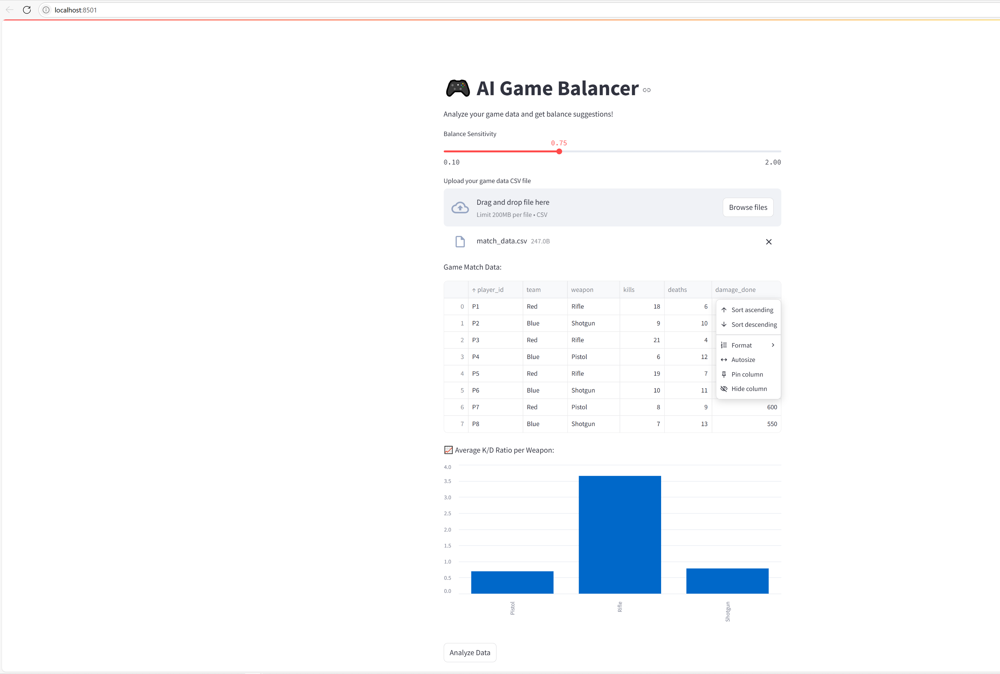
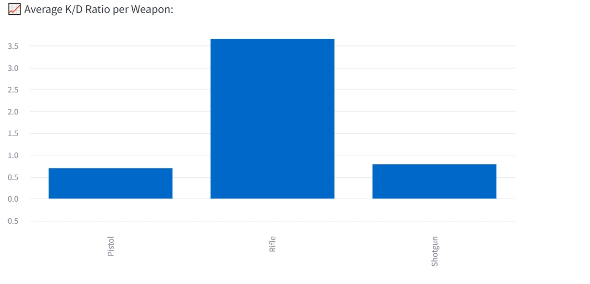
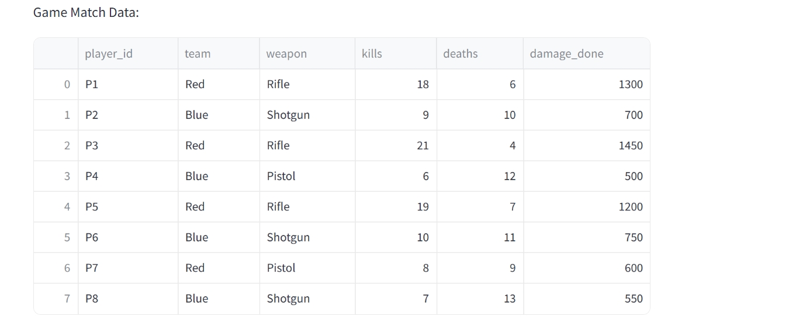
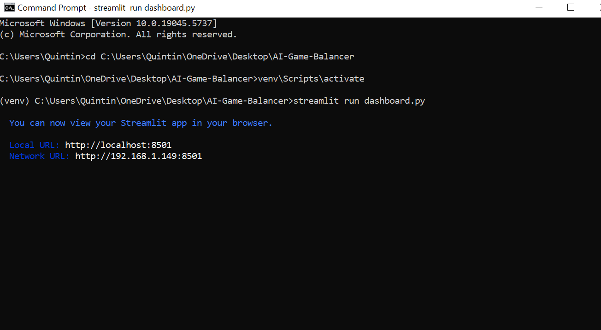
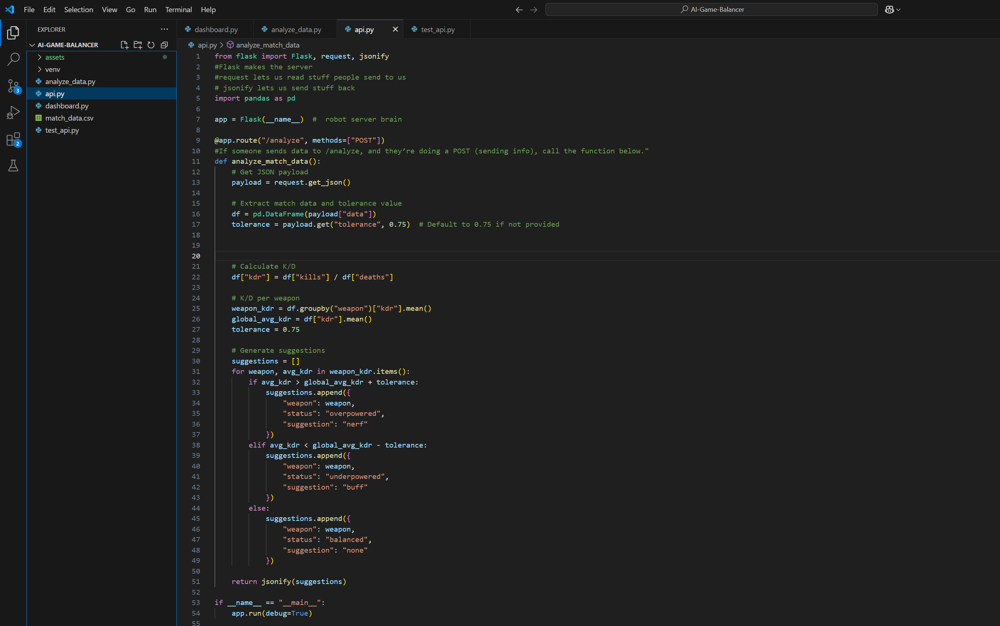
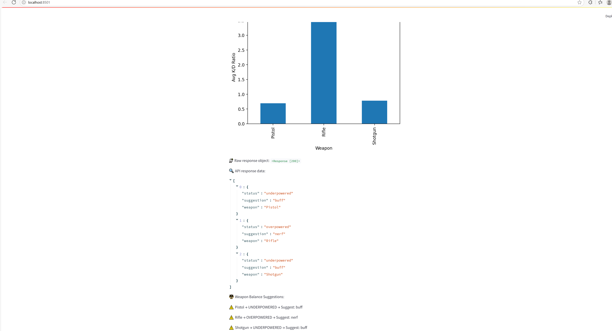

# AI Game Balancer

This project analyzes multiplayer match data and provides suggestions for balancing weapons based on kill/death ratios. It identifies overpowered or underpowered weapons and recommends buffs or nerfs accordingly. The app includes an interactive frontend built with Streamlit and a backend API powered by Flask.

## Features

- Upload match data via CSV
- Calculates average kill/death ratio (K/D) for each weapon
- Identifies overpowered and underpowered weapons
- Adjustable balance sensitivity via a slider
- Visual bar chart showing average K/D per weapon
- Flask backend and Streamlit frontend

## Screenshots

### Dashboard View

### K/D Ratio Chart

### Uploaded Match Data Preview

### Flask Backend Running

### Code Preview

### Updated Dashboard View

## How to Run

### 1. Clone this repository
git clone https://github.com/Vizzaq23/ai-game-balancer-.git
cd ai-game-balancer-
### 2 Create and activate a virtual environment
-python -m venv venv
-venv\Scripts\activate  # On Windows
### 3. Install dependencies
-pip install -r requirements.txt
4. Run the Flask API
- python api.py
5. Run the Streamlit dashboard
In a second terminal:
-streamlit run dashboard.py

## CSV Format Example
player_id,team,weapon,kills,deaths,damage_done
player_id,team,weapon,kills,deaths,damage_done
P1,Red,Rifle,18,6,1300
P2,Blue,Shotgun,9,10,700
...
## Tech Stack
Python

Flask

Streamlit

Pandas

Requests

Created By
Quintin Vizza
Email: vizzaq@mail.sacredheart.edu
LinkedIn: https://www.linkedin.com/in/Quintin-Vizza

Future Improvements
Detect team-based imbalance

Add more visualizations (weapon usage, damage trends)

Deploy online using Streamlit Cloud or Hugging Face

