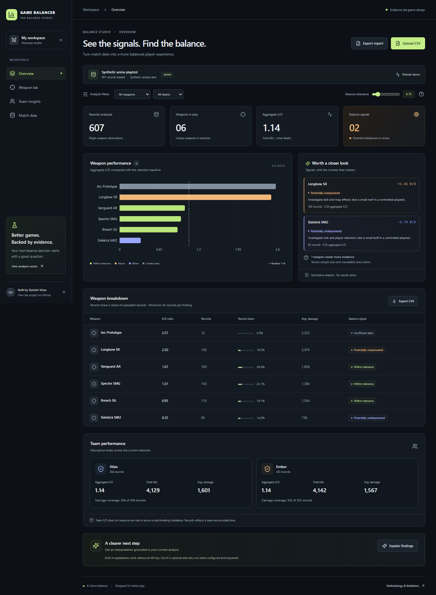
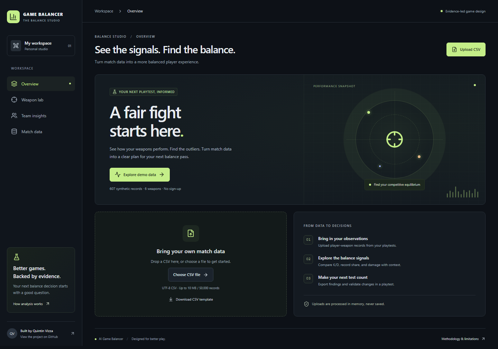
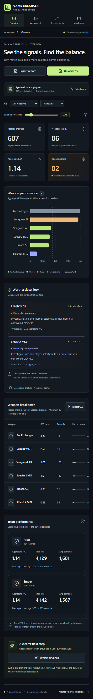

# AI Game Balancer

### Multiplayer playtest analytics, with evidence you can inspect.

[](https://github.com/Vizzaq23/ai-game-balancer-/actions/workflows/ci.yml)


AI Game Balancer turns CSV playtest observations into an interactive dashboard for investigating weapon and team performance. Explore a synthetic dataset, compare aggregate metrics, adjust the detection tolerance, and export a report that explains the evidence and its limitations.

**[Live demo](https://ai-game-balancer.vercel.app) · [Render demo](https://ai-game-balancer.onrender.com) · [Quick start](#run-locally-on-windows) · [Methodology](#how-the-analysis-works) · [API reference](docs/API.md) · [Deployment guide](docs/DEPLOYMENT.md)**



> The dashboard is hosted on Vercel, with its Flask API on Render's free plan. The API may take around a minute to wake after inactivity; retry if an initial analysis request times out. Built-in explanations are enabled; no API key or account is needed to try it. Render also serves the complete app at the alternate demo link.

## What you can do

| Capability | What it provides |
| --- | --- |
| Demo onboarding | 607 reproducible **synthetic** observations across six weapons and two teams, including suspicious and insufficient-data examples. |
| CSV analysis | Actionable validation, weapon/team filters, and a searchable, paginated record table. |
| Performance comparisons | Aggregate K/D, record share, sample counts, damage coverage, and team totals. |
| Balance signals | Adjustable absolute K/D tolerance with visible evidence and minimum-sample safeguards. |
| Portable reports | Weapon metrics as CSV and a standalone HTML report containing filters, methodology, findings, and explanations. |
| Optional AI | Explicitly requested server-side OpenAI explanations, with built-in explanations available by default. |
| Responsive interface | Dark dashboard with mobile layouts, keyboard navigation, and loading, empty, and error states. |

Uploads exist only in memory. There are no accounts, saved datasets, billing, patch comparisons, or predictive balance simulations.

<details>
<summary>Welcome screen and mobile layout</summary>




</details>

## Run locally on Windows

Install Python 3.12 and Node.js 22 or newer, then run in PowerShell:

```powershell
git clone https://github.com/Vizzaq23/ai-game-balancer-.git
cd ai-game-balancer-
python -m venv .venv
.\.venv\Scripts\python.exe -m pip install -r requirements-dev.txt
cd frontend
npm ci
npm run build
cd ..
.\.venv\Scripts\python.exe api.py
```

Open [localhost:5000](http://localhost:5000). Click **Explore demo data** or **Upload CSV**. No `.env` file or paid AI service is required. This local server is for development; deployment uses Gunicorn in Docker.

On macOS/Linux, create the same virtual environment and use `.venv/bin/python` in place of `.\.venv\Scripts\python.exe`.

For frontend development, keep Flask running and run `npm run dev` in a second terminal inside `frontend/`. Open the Vite URL printed in that terminal; its `/api` requests proxy to Flask on port 5000.

## Your CSV

```csv
player_id,team,weapon,kills,deaths,damage_done
P001,Atlas,Rifle,12,10,1450
P002,Ember,SMG,10,12,1220
```

Only `weapon`, `kills`, and `deaths` are required. The other columns are optional. One row should represent one player's performance with one weapon in one match; a row is **not necessarily a unique match or player**. Unknown columns are ignored. Download a template from the welcome screen or methodology dialog.

CSV limits: **10 MiB / 50,000 rows**. Text fields must contain 1–120 characters. Kills/deaths are non-negative whole numbers; damage is a non-negative number. Missing required values, invalid numbers, malformed quoting, and duplicate headers return actionable errors. The original eight-row `match_data.csv` remains available, but its weapons correctly receive insufficient-data labels.

## How the analysis works

1. Apply the weapon/team filters, then calculate the baseline as **total kills ÷ total deaths**.
2. Calculate the same aggregate ratio for each weapon. This avoids averaging individual K/D ratios with very different denominators.
3. Require at least **20 records** for a weapon before flagging it. This is a transparent minimum-sample rule, not a statistical confidence guarantee.
4. Flag a potential imbalance only when the weapon's K/D differs from the selection baseline by **more than** the absolute tolerance (default **0.75**, range 0–5).
5. Show zero-death group ratios as **N/A** and omit ratio-based recommendations. Individual zero-death rows still contribute to totals.

Record share means a share of uploaded observations (or the filtered subset), **not time played**. Partial damage metrics report coverage. Team performance is descriptive and does not imply win rates or matchmaking quality. Selecting one weapon makes its K/D equal the baseline, so compare multiple weapons to evaluate relative performance.

Skill, map, mode, weapon roles, repeated players, and selection bias can explain apparent differences. K/D does not prove a weapon is too strong or prescribe an exact damage change. Treat findings as prompts for controlled playtests.

## What “AI” means here

The calculations and classifications are deterministic; they do not use a trained predictive model. The optional AI layer explains the computed evidence and proposes experiments. The UI explicitly distinguishes **built-in** and **AI-generated** explanations.

To opt in, copy `.env.example` to `.env`, set `ENABLE_LIVE_AI=true`, supply your server-side `OPENAI_API_KEY`, and choose an available `OPENAI_MODEL`. Restart Flask. Do not put secrets in frontend variables or commit `.env`. API usage may incur charges.

Only aggregate weapon findings are sent to OpenAI—never player IDs or raw records. Explanation calls run only on request, with a timeout and conservative hourly cap. Missing credentials or provider failures keep the dashboard usable through built-in explanations. See [API details](docs/API.md) for limits and behavior.

## Quality and verification

GitHub Actions runs backend tests, the TypeScript/production build, desktop and mobile browser workflows, and a Docker build with container health checks. AI provider calls are mocked in tests.

With Flask serving the production build:

```powershell
.\.venv\Scripts\python.exe -m pytest -q
cd frontend
npm run build
npx playwright install chromium
npm run test:e2e
```

The tests cover calculation boundaries, minimum samples, zero deaths, validation and upload limits, filtering, API compatibility, mocked AI success/failure, complete desktop/mobile workflows, exports, keyboard interaction, and automated accessibility checks. No paid API calls are required. Automated accessibility checks supplement manual review; they are not a claim of complete WCAG conformance.

To regenerate screenshots from the running app: `node scripts/capture.mjs` inside `frontend/`. Screenshots use synthetic data. Python dependencies are pinned in `requirements*.txt` and frontend dependencies in `frontend/package-lock.json`. Update Python locks deliberately with `pip-compile requirements.in -o requirements.txt` and `pip-compile requirements-dev.in -o requirements-dev.txt` after installing `pip-tools`.

## Architecture

```text
Browser: React + TypeScript + Tailwind + Recharts
                         |
                 Flask /api/v1/*
                         |
             Shared Python analysis engine
                |                     |
       Built-in explanations   Optional OpenAI request
                               (aggregate findings only)
```

`balancer/` holds the shared Python engine; `api.py` exposes the API and serves the built frontend. The CLI (`python analyze_data.py match_data.csv`) uses the same engine. `frontend/` uses React, TypeScript, Vite, Tailwind, Recharts, and Lucide icons. Versioned interfaces and the legacy `/analyze` adapter are documented in [API.md](docs/API.md).

| Path | Responsibility |
| --- | --- |
| `frontend/src/` | Dashboard, API client, charts, and browser-side exports. |
| `balancer/` | CSV validation, aggregation, synthetic demo, and explanations. |
| `api.py` | Flask routes, consistent API responses, and static frontend serving. |
| `analyze_data.py` | Command-line access to the shared analysis engine. |
| `tests/` | Backend unit and API tests. |
| `frontend/tests/` | Playwright browser and accessibility checks. |
| `docs/` | API contract and release operations. |

## Deployment

The Docker image builds the frontend and serves both UI and API through Gunicorn as one non-root service. No database or persistent disk is required. `render.yaml` configures Render with live AI disabled.

```sh
docker build -t ai-game-balancer .
docker run --rm -p 10000:10000 -e ENABLE_LIVE_AI=false ai-game-balancer
```

Open [localhost:10000](http://localhost:10000). The container exposes `/health` for readiness checks.

The public dashboard is available on **[Vercel](https://ai-game-balancer.vercel.app)**, with the complete Docker app also available on **[Render](https://ai-game-balancer.onrender.com)**. Vercel builds `frontend/` and proxies API requests to Render using `frontend/vercel.json`; no frontend secrets are required. The Vercel deployment passed all 10 desktop/mobile workflow tests and live checks for the 10 MiB / 50,000-row upload boundary. See the [deployment guide](docs/DEPLOYMENT.md) for setup, release verification, and rollback instructions.

## Project background

Built by **[Quintin Vizza](https://www.linkedin.com/in/Quintin-Vizza)** as a portfolio project demonstrating full-stack engineering, explainable analytics, and tested deployment workflows.

The project evolved from a Flask/Streamlit prototype into a React application with a shared analysis engine. The original implementation remains in Git history. The scope is descriptive playtest analysis: it does not predict ideal balance, prescribe exact damage adjustments, or replace controlled experiments.
